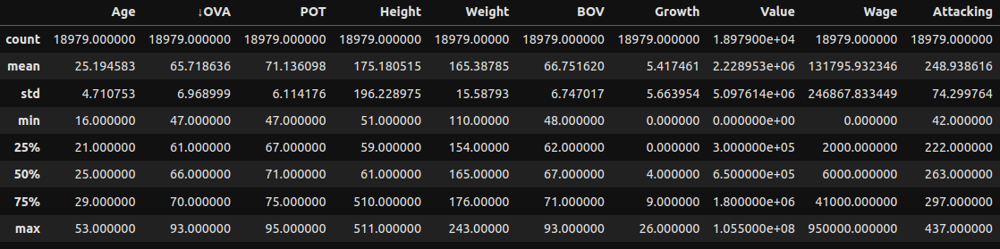
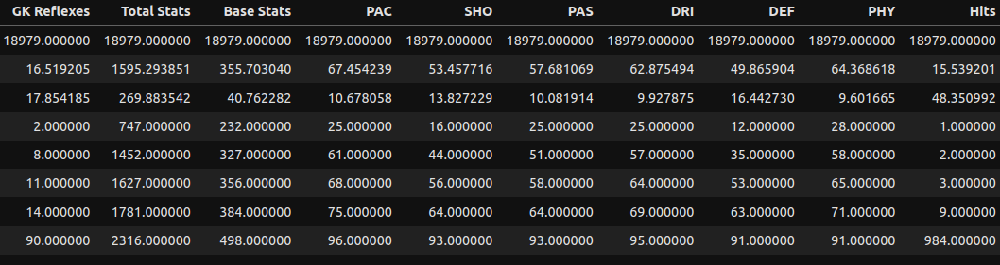
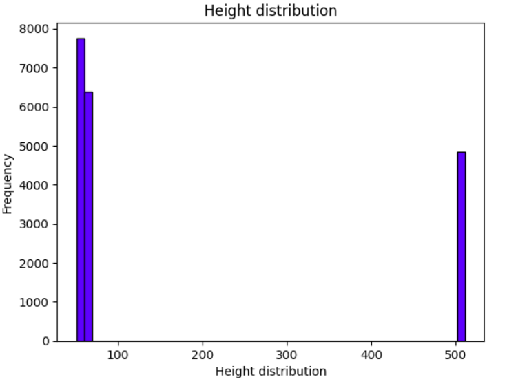
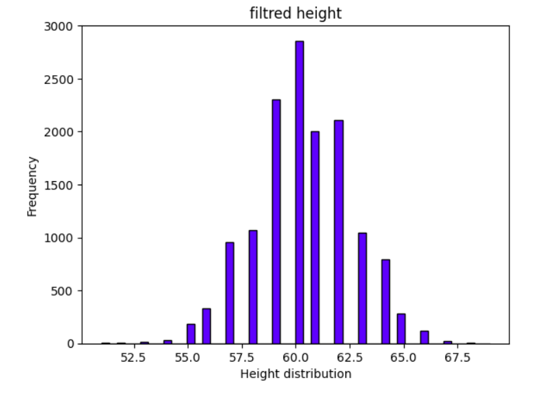
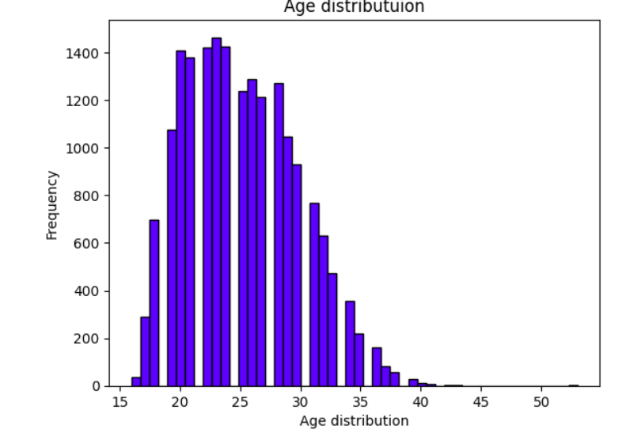

# Exploratory Data Analysis of Physical Performance Dataset 
# project overveiw
this project is focuses on cleaning and analyzing the relationships between physical attributes like Height,
Weight, Strenght, and Stamina. the goal is uncover petterns and insights that could inform training decisions in sport performance

# Datasets
This dataset, sourced from Kaggle via the Kaggle API, contains detailed information about football players, with 79 columns that offer insights into various aspects of their performance, attributes, and characteristics. The dataset includes player demographics (e.g., age, height, weight), overall and potential ratings, attacking, defending, and skill attributes, as well as monetary values like market value and wages. These features make the dataset suitable for player analysis, performance evaluation, and sports analytics. It is ideal for tasks such as exploratory data analysis (EDA), predictive modeling, and decision-making in football management.

# Player Attributes Description

## General Player Information
| **Column** | **Description** |
|------------|-----------------|
| Age        | The player's age. |
| Height     | The player’s height, usually in cm or feet/inches. |
| Weight     | The player’s weight, typically in kg or lbs. |

## Overall and Potential Ratings
| **Column**        | **Description** |
|--------------------|-----------------|
| OVA (Overall)     | The player’s overall rating, representing their current ability level. |
| POT (Potential)   | The player’s potential rating, representing their maximum possible ability. |
| BOV (Base Overall Value) | A raw metric of the player’s ability used for internal calculations. |
| Growth            | The potential improvement a player can achieve, calculated as POT - OVA. |

## Monetary and Contract Information
| **Column** | **Description** |
|------------|-----------------|
| Value      | The player’s estimated market value, usually in a currency (e.g., millions of Euros). |
| Wage       | The player’s weekly salary, usually in the same currency as Value. |

## Attacking Attributes
| **Column**        | **Description** |
|--------------------|-----------------|
| Attacking         | A general score summarizing the player’s attacking skills. |
| Crossing          | The player’s ability to deliver accurate crosses from wide positions. |
| Finishing         | The player’s ability to score goals in one-on-one or shooting situations. |
| Heading Accuracy  | The player’s ability to score or clear the ball using their head. |
| Short Passing     | The accuracy and quality of short-distance passes. |
| Volleys           | The player’s ability to strike the ball cleanly in mid-air. |

## Skill Attributes
| **Column**        | **Description** |
|--------------------|-----------------|
| Skill             | A general score summarizing technical abilities. |
| Dribbling         | The player’s ability to control the ball while running. |
| Curve             | The player’s ability to add curve to their passes or shots. |
| FK Accuracy       | The accuracy of the player’s free kicks. |
| Long Passing      | The accuracy of long-distance passes. |
| Ball Control      | The player’s ability to control and manipulate the ball during play. |

## Movement Attributes
| **Column**        | **Description** |
|--------------------|-----------------|
| Movement          | A general score summarizing movement-related skills. |
| Acceleration      | The player’s ability to reach top speed quickly. |
| Sprint Speed      | The player’s top running speed. |
| Agility           | How well the player can move and change direction. |
| Reactions         | The player’s responsiveness to in-game situations. |
| Balance           | The player’s ability to remain stable while moving or being tackled. |

## Power Attributes
| **Column**        | **Description** |
|--------------------|-----------------|
| Power             | A general score summarizing physical strength and shooting power. |
| Shot Power        | The strength of the player’s shots. |
| Jumping           | The player’s ability to jump high for aerial duels. |
| Stamina           | The player’s endurance during a match. |
| Strength          | The player’s physical strength in duels and shielding. |

## Shooting Attributes
| **Column** | **Description** |
|------------|-----------------|
| Long Shots | The player’s accuracy and power in taking long-range shots. |

## Mentality Attributes
| **Column**        | **Description** |
|--------------------|-----------------|
| Mentality         | A general score summarizing mental aspects of the game. |
| Aggression        | The player’s intensity in tackles and duels. |
| Interceptions     | The player’s ability to read and intercept passes. |
| Positioning       | The player’s ability to find effective positions on the field. |
| Vision            | The player’s ability to spot opportunities for passes or movement. |
| Penalties         | The player’s ability to take penalty kicks. |
| Composure         | The player’s ability to remain calm under pressure. |

## Defending Attributes
| **Column**        | **Description** |
|--------------------|-----------------|
| Defending         | A general score summarizing defensive skills. |
| Marking           | The player’s ability to track opponents off the ball. |
| Standing Tackle   | The player’s ability to perform accurate standing tackles. |
| Sliding Tackle    | The player’s ability to execute clean sliding tackles. |

## Goalkeeping Attributes
| **Column**        | **Description** |
|--------------------|-----------------|
| Goalkeeping       | A general score summarizing goalkeeping abilities. |
| GK Diving         | The goalkeeper’s ability to dive for shots. |
| GK Handling       | The goalkeeper’s ability to catch or control the ball after a save. |
| GK Kicking        | The goalkeeper’s accuracy and power when kicking the ball. |
| GK Positioning    | The goalkeeper’s ability to position themselves effectively. |
| GK Reflexes       | The goalkeeper’s reaction time to save shots. |

## Aggregate Stats
| **Column** | **Description** |
|------------|-----------------|
| Total Stats | The sum of all skill-related stats, representing overall player ability. |
| Base Stats  | A subset of the most fundamental stats for player performance. |

## Specialized Metrics
| **Column** | **Description** |
|------------|-----------------|
| PAC (Pace) | A combination of Acceleration and Sprint Speed. |
| SHO (Shooting) | A combination of shooting-related stats like Finishing and Shot Power. |
| PAS (Passing) | A combination of passing-related stats like Short Passing and Long Passing. |
| DRI (Dribbling) | A combination of Dribbling and Ball Control. |
| DEF (Defending) | A combination of defensive stats like Standing Tackle and Interceptions. |
| PHY (Physical) | A combination of physical stats like Strength and Stamina. |

## Engagement Metrics
| **Column** | **Description** |
|------------|-----------------|
| Hits       | Represents player popularity or the number of times the player’s profile has been viewed. |

## executive summary
**overview of finding**: After cleaning and formatting the data, we reached the stage where we can perform exploratory data analysis (EDA). EDA allows us to gain deeper insights into the dataset, uncover patterns, and identify relationships between variables. This process is crucial for understanding the data better and making informed decisions.

### **Summary of Key Findings**

#### **General Player Information**
- **Age**: The average player age is approximately 25 years, with a range spanning from **16 to 53 years**.
- **Height and Weight**:
   - Height shows significant variation, with an **average height of 175.18 cm**.
   - The average weight is **165.39 kg**, with a standard deviation of 15.59 kg.

#### **Player Ratings**
- **Overall Rating (OVA)**: The mean player rating is **65.7**, with a maximum of **93**.
- **Potential (POT)**: Players have an average potential rating of **71.1**, indicating opportunities for growth.
- **Growth**: On average, players have a **growth score of 5.4**, showing the potential improvement from their current level.

#### **Monetary and Contract Information**
- **Market Value**: 
   - The average player market value is approximately **2.2 million Euros**, with notable variation (standard deviation: 5.09M).
   - Minimum value is **0**, while the maximum reaches **105.5 million Euros**.
- **Wage**: Weekly wages vary greatly, with an average wage of **131,795 Euros** and a maximum of **950,000 Euros**.

#### **Skill and Performance Metrics**
- **Attacking**: 
   - Average score is **248.93**, with a maximum of **437**.
- **PAC (Pace)**: The average pace is **67.45**, with a maximum of **96**.
- **SHO (Shooting)**: Shooting scores average **53.45**, with a high of **93**.
- **PAS (Passing)**: The mean passing score is **57.68**, with a maximum of **93**.
- **DRI (Dribbling)**: Dribbling averages **62.87**, highlighting strong ball control skills.
- **DEF (Defending)**: Defending skills show a mean of **49.86**, with a standard deviation of **16.44**.
- **PHY (Physical)**: Players have an average physicality score of **64.37**.

#### **Goalkeeping and Total Stats**
- **GK Reflexes**: Goalkeepers exhibit an average reflex score of **16.5**, with a maximum of **90**.
- **Total Stats**: Summing all skill-related attributes, players have an average total score of **1595.29**, with a wide range from **747 to 2316**.

#### **Engagement Metrics**
- **Hits**: Players' popularity varies significantly, with an average of **15.54 hits** and a maximum of **984 hits**, suggesting diverse levels of engagement.

### Height Distribution

The histogram below displays the distribution of height values in the dataset. Two distinct groups are visible:

1. **Group 1 (left side)**: Most of the heights fall within a range between approximately **50–100 units**.
2. **Group 2 (right side)**: A smaller group has height values around **500 units**, creating a significant outlier.

This suggests an issue with the data, possibly caused by incorrect formatting or unit discrepancies. For example, the "500" values might indicate erroneous data entries that need cleaning for accurate analysis.

The updated height distribution graph shows a more realistic spread of player heights after removing the outliers `(values around 500)`. The data now follows a concentrated pattern within a smaller range, likely between 50 and 100 units, depending on the dataset's scale.

- **Peak Frequency**: Most players' heights are concentrated within a narrow range, with the majority of values clustered towards the lower end of the scale.
- **Normal Distribution**: The histogram now suggests a more uniform and logical distribution without extreme values disrupting the visualization.
- **Insights**: Removing the outliers allows for clearer analysis of the actual player heights and reveals the underlying trends in the dataset.

## Age Distribution of Football Players

The histogram illustrates the age distribution of professional football players. The data reveals that the majority of players fall within the **20 to 30 years** age range, with the peak concentration observed between **23 and 25 years**, highlighting the prime athletic years in professional football. Beyond the age of **30**, the frequency declines significantly, and players above **35 years** are notably rare. This distribution underscores the emphasis on youth and peak physical performance in professional football.

## Results
-- Key findings or outcomes of the analysis.
Include visualizations, charts, or summaries (if applicable)

##  How to Use This Repository
...

## Folder Structure

## Contact Information

